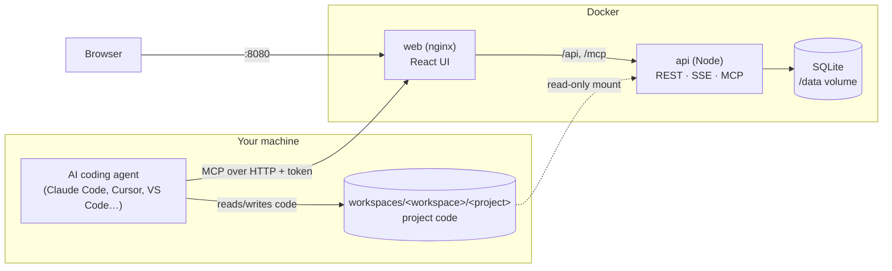

# Loop Coder

**An Agile/Scrum Kanban board that your AI coding agent works through on its own.**

You describe what to build. Your coding agent (Claude Code, Cursor, VS Code Copilot, or any
other MCP client) connects to Loop Coder's MCP server and runs a whole delivery team: as **Project Manager** it plans the backlog, then it designs,
implements, reviews and tests each item in the matching role, writing remarks as it goes,
until every card is in **Done**. You watch the board update live, answer the questions it
asks, and can pause it at any time.

- **Workspaces → projects → one board per project**, with members and roles per workspace.
- **Real SDLC and Scrum:** epics, stories, tasks, bugs, spikes; story points; dependencies;
  Definition of Ready and Done; sprint planning, review and retrospective; WIP limits; burndown.
- **One agent, nine roles:** Project Manager, Software Architect, UI/UX Designer, Software
  Engineer, Code Reviewer, QA Engineer, DevOps, Security and Technical Writer. Their
  instructions are editable, and you can add your own roles.
- **Realtime:** cards move, glow while the agent works on them (labelled with its name, e.g.
  "Claude Code" or "Cursor"), and stream activity as it happens.
- **Flow view:** the SDLC as a live, animated graph. Agents glide between stages, work items
  travel along the paths, rework and escalations light up, and you can replay the whole history
  or one item's journey with the time it spent in each stage.
- **Agent office:** the same live data as a pixel-art game. Each agent is a character dressed
  for the role it plays (roles you add get their own look), walks to its station, talks about
  its work in speech bubbles, and reacts when you poke it. It has 8-bit sound effects, original
  chiptune music and a game menu.
- **Admin console:** users, workspaces, agent roles, settings, tokens, agent sessions, audit
  log, system info, one-click database backup.
- **Secure by default:** hardened containers, strict CSP, CSRF protection, hashed secrets,
  rate limiting, account lockout, least-privilege tokens.
- **Self-hosted with Docker.** SQLite storage is created automatically on first start.

📘 **New here? Read the illustrated [user guide](docs/USER_GUIDE.md).**


### See the agents at work

| Flow view | Agent office |
|---|---|
|  |  |
| Live SDLC graph with replay and item journeys. | Pixel-art office with speech bubbles, sound and music. |



## Quick start

Requirements: **Docker Desktop** (or Docker Engine with Compose v2) and an **MCP-capable
coding agent**, for example Claude Code, Cursor or VS Code with GitHub Copilot.
Node.js is only needed if you want to develop Loop Coder itself.

```bash
docker compose up -d --build      # or: npm run up  (stamps the version and commit into the images)
```

1. Open **http://localhost:8080**. The setup wizard starts automatically on first run.
2. Get the one-time setup code from the server logs:
   ```bash
   docker compose logs api | grep -i "setup code"              # macOS / Linux / Git Bash
   docker compose logs api | Select-String "setup code"        # Windows PowerShell
   ```
3. Create the administrator account and your first workspace.

The SQLite database is created on the `loop_data` Docker volume the first time the API
starts. Migrations run automatically on every start.

## Let your agent work the board

1. **Create a project** in your workspace and describe its goal in as much detail as you can.
2. Open the project's **Agent** tab, pick your tool (**Claude Code**, **Cursor**, **VS Code** or
   **Other MCP client**) and your operating system, and click **Create project token**. The
   token is shown once, and every snippet on the page is filled in with it.
3. Follow the four steps shown there: create the project folder (`workspaces/<workspace>/<project>`),
   connect the agent, and start the loop. For example, with Claude Code (inside the project folder):
   ```bash
   claude mcp add --transport http loopcoder http://localhost:8080/mcp \
     --header "Authorization: Bearer lc_pat_…"
   claude
   ```
   ```
   /mcp__loopcoder__work SHOP          # or keep it running: /loop /mcp__loopcoder__work SHOP
   ```
   Cursor and VS Code use a project `mcp.json` file. Clients without remote-server support
   use the `mcp-remote` bridge. Clients without MCP prompts get copy-paste loop
   instructions. The [user guide](docs/USER_GUIDE.md) and [docs/MCP.md](docs/MCP.md) cover each case.

The agent repeatedly calls `get_next_work`, does what the returned role and instructions
say, and hands the item on. It stops when the board is done, paused, or waiting for you.
Every action on the board is labelled with the agent's name (taken from the MCP client).

## How the board works

| Column | Who works it | What happens |
|---|---|---|
| **Backlog** | Project Manager | Refinement: user stories, acceptance criteria, estimates, roles, dependencies, splitting. Ready items are marked *refined*. |
| **To Do** | the item's assigned role (default Software Engineer) | Sprint backlog. When pulled, the item moves to In Progress. |
| **In Progress** | the item's assigned role | Design, implementation, DevOps or docs work in the repository. |
| **Code Review** | Code Reviewer | Approve → QA, or send back with a numbered list of changes. |
| **QA / Testing** | QA Engineer | Verify every acceptance criterion and the Definition of Done → Done, or send back. |
| **Needs Human** | you | The agent's questions and items escalated after too many rework cycles. Answer with **Answer & resume**. |
| **Done** | none | Epics complete automatically when all their children are done. |

`get_next_work` follows Scrum. It runs the **kickoff** first, then finishes started sprint
work, pulling from the right so items closest to Done come first. It also respects
dependencies and WIP limits. Then comes **backlog refinement**, then the **sprint review
and retrospective** when the sprint can't progress further, then the next **sprint
planning**. Project notes act as shared memory between roles and sessions.

You can rename columns, recolour them, set WIP limits and remap roles (Project →
Settings). Roles and their instructions are edited in Administration → Agent roles.

## Managing Loop Coder

- **Workspace roles:** *owner* manages members and settings; *editor* works with items and
  sprints and can pause or resume the agent; *viewer* has read-only access. Every project
  inherits its workspace's access.
- **Platform administrators** (Administration) manage all users, workspaces and projects,
  agent roles, global settings (registration, password policy, session and token lifetime,
  rework limit, claim timeout, agent kill switch), all access tokens, agent sessions, the
  audit log, and download online database backups.
- **Access tokens** (Account → Access tokens) can be scoped to one project or one
  workspace and always expire. Revoke them at any time.

## Configuration

Copy `.env.example` to `.env`. Every value is optional.

| Variable | Default | Purpose |
|---|---|---|
| `BIND_ADDRESS` / `WEB_PORT` | `127.0.0.1` / `8080` | Where the UI listens. Keep localhost unless a TLS proxy fronts it. |
| `APP_ORIGIN` | (empty) | Comma-separated public URL(s), canonical first; enables strict origin checks. |
| `EDGE_NETWORK` | `loop-coder-edge` | Docker network a tunnel connector joins to reach the UI. |
| `CLOUDFLARE_TUNNEL_TOKEN` | (empty) | Only for the optional built-in connector (`--profile tunnel`). |
| `COOKIE_SECURE` | `auto` | Secure cookies when the request came over HTTPS. |
| `SETUP_CODE` | random | Fixed one-time setup code (otherwise printed to the logs). |
| `WORKSPACES_HOST_DIR` | `./workspaces` | Host folder for project code, mounted read-only for the file browser. |
| `LOG_LEVEL` | `info` | API log level (JSON logs). |

## Publishing on the internet

Use a Cloudflare Tunnel (or another TLS reverse proxy). Keep the port bound to localhost
and set `APP_ORIGIN` to your public URL. [docs/DEPLOY.md](docs/DEPLOY.md) explains how to
attach an existing cloudflared container to the `loop-coder-edge` network, the Cloudflare
settings to use (Rocket Loader off, a WAF skip for `/mcp`), and why to finish the setup
wizard right away.

## Versioning and releases

Loop Coder uses [Semantic Versioning](https://semver.org/). The version in the root
`package.json` is the single source of truth.

```bash
npm run release -- minor   # bumps every package, rolls CHANGELOG.md, syncs the image tag
git commit -am "chore(release): v0.2.0" && git tag v0.2.0
npm run up                 # builds loop-coder-api/web:0.2.0 with commit + build time
```

The running version shows in the sidebar footer, at `/api/version`, and under
Administration → System. After a deploy, open browsers offer a **Reload** to pick up the
new UI.

## Backups

Administration → System → **Download backup** creates a consistent snapshot while the app
is running. To back up the volume directly:

```bash
docker run --rm -v loop-coder_loop_data:/data -v "$PWD":/backup alpine \
  tar czf /backup/loopcoder-data.tgz -C /data .
```

## Development and tests

```bash
npm install
npm run dev:api          # API on :3000 (SQLite at ./data/loopcoder.db)
npm run dev:web          # UI on :5173 with /api and /mcp proxied to :3000
npm test                 # API unit/integration + web unit/component tests
npm run e2e              # Playwright against an isolated Docker stack on :18090
```

See [docs/DEVELOPMENT.md](docs/DEVELOPMENT.md), [docs/ARCHITECTURE.md](docs/ARCHITECTURE.md),
[docs/MCP.md](docs/MCP.md) and [docs/SECURITY.md](docs/SECURITY.md).

## Project layout

```
apps/
  api/        Express API: REST, Server-Sent Events, MCP server, SQLite (Drizzle)
  web/        React 19 + Vite + Tailwind 4 UI, served by nginx in Docker
packages/
  shared/     Types, validation schemas and constants shared by API and UI
e2e/          Playwright end-to-end tests (run against Docker)
scripts/      compose wrapper (version stamping) and release script
docs/         Architecture, MCP reference, security, development
```

## Troubleshooting

- **"Invalid setup code":** without `SETUP_CODE` in `.env`, the code changes on every API restart. Read
  the latest one from `docker compose logs api`.
- **The agent gets 401 from the MCP server:** the token is expired or revoked, or the
  header is missing the `Bearer ` prefix. Create a new one on the project's Agent tab.
- **The file browser is empty:** the agent has not written code yet, or it works in a different
  folder than `workspaces/<workspace>/<project>`.
- **The agent says "STATUS: PAUSED":** resume it from the board header. Also check
  Administration → Settings → *Agent work enabled*.
