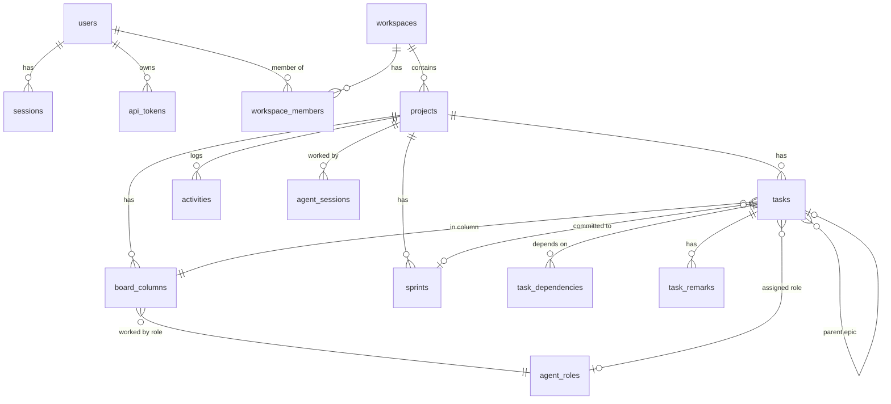

# Architecture

## Components

| Component | Tech | Responsibility |
|---|---|---|
| `apps/web` | React 19, React Router 8, TanStack Query, dnd-kit, Tailwind 4, Vite 8 | UI. Served as static files by unprivileged nginx, which also reverse-proxies `/api` and `/mcp`. |
| `apps/api` | Node 24, Express 5, Drizzle ORM, better-sqlite3, MCP TypeScript SDK | REST API for the UI, Server-Sent Events for live updates, the MCP server for Claude Code, and the workflow engine. |
| `packages/shared` | TypeScript + Zod | Domain constants, validation schemas and DTO types used by both sides. |
| SQLite | WAL mode on the `/data` volume | All state. Created and migrated automatically on start. |

Claude Code runs **on the host**, not in a container. It reaches the MCP server through
nginx (`http://localhost:8080/mcp`) with a personal access token, and writes code into
`workspaces/<workspace-slug>/<project-key>`. That folder is mounted read-only into the API
for the in-app file browser.

## API module layout

```
apps/api/src/
  config/        env (zod-validated), version info
  db/            schema, client, migrator          → drizzle/ holds generated SQL migrations
  lib/           errors, crypto, http helpers, actor, time, logger
  middleware/    session auth, CSRF, rate limits, error handler, request log
  realtime/      in-process event bus (+ EventBatch: publish only after commit), SSE stream
  mcp/           MCP route (stateless Streamable HTTP), server factory + tools, auth, formatting
  modules/
    auth/        login, setup wizard, sessions, password policy
    account/     profile, tokens, sessions (self-service)
    admin/       admin routes, stats, system info, backup
    workspaces/  workspaces + members
    projects/    projects, columns, access control (workspace-inherited)
    tasks/       work items, remarks, dependencies, moves, epics
    sprints/     sprints, burndown
    workflow/    next-work selection, claims, ceremonies, role instructions
    roles/       built-in SDLC roles + custom roles
    presence/    agent sessions / online status
    activity/    project activity feed
    audit/       security audit log
    settings/    admin settings (cached)
    files/       read-only workspace file browser
  app.ts         express app composition (used by tests too)
  bootstrap.ts   migrate + seed defaults
  index.ts       process entry, graceful shutdown
```

Services hold the business rules. Routes and MCP tools are thin adapters that validate
input and call services. All database access is synchronous (better-sqlite3), so each
transaction is atomic within the single Node process. Events are collected in an
`EventBatch` and published only after the transaction commits.

## Data model



Every board has exactly one column per *kind*: `backlog`, `todo`, `in_progress`, `review`,
`testing`, `blocked`, `done`. Names, colours, WIP limits and role mappings can change, but
the kinds anchor the workflow rules.

## Workflow engine (`modules/workflow`)

`get_next_work` decides, inside one transaction:

1. **Kickoff** until `kickoffCompletedAt` is set (a project-level ceremony claim).
2. **Sprint work:** items in To Do, In Progress, Review or Testing that belong to the
   active sprint (or to no sprint). They must not be epics or assigned to a human, must not
   be claimed by someone else, and every dependency must be done. Items are sorted with the
   agent's own claim first, then column position descending (finish work before starting
   new work), then priority, then position. When In Progress is at its WIP limit, To Do
   items are skipped.
3. **Refinement** of unrefined backlog items, epics included.
4. **Sprint review** when an active sprint has no actionable work left.
5. **Sprint planning** when there is no active sprint and refined items exist.
6. Otherwise **complete** or **waiting** (blocked items, human-owned items, open dependencies).

The **effective role** is the column's role. For columns with `roleSource = task`
(To Do, In Progress) it is the item's assigned role, if it is enabled.

**Claims** (`claimedBy = token:<id>`, with an expiry) stop parallel sessions from
colliding. Any stage change releases the claim, and `log_progress` extends it.

**Roles per agent:** a token's `roleKeys` (null for every role) travel on the actor. The role
map used for the effective role keeps only those roles, so an agent never gets an item or a
stage outside them. Ceremonies need the Project Manager role; an active sprint is not
reviewed while sprint candidates remain for roles the calling agent does not play.

**Git worktrees** (`workflow/git.ts`): the server never runs git (the workspaces are mounted
read-only); it tells agents exactly what to run. In `gitMode = worktrees` every agent (token)
has a worktree `<workspace>/<project>.worktrees/<token-name>-<token-id>` and every item a
branch `item/<KEY>`. Developers commit on the branch and detach when they hand it on;
reviewers and QA use detached checkouts; whoever moves the item to Done merges it with
`--no-ff` into `baseBranch` in the project folder. Every value that ends up in a command is
restricted to safe characters: slugs, project keys and `branchNameSchema` for the base branch.

**Rework:** moving an item from review or testing back to development increments
`bounceCount`. When the agent exceeds the admin's limit, the item goes to **Needs Human**
with a system remark. A human answer with *resume* returns it to the stage it came from
and resets the counter.

## AI providers and the egress gateway

- **Secrets at rest** (`lib/secrets.ts`): API keys are sealed with AES-256-GCM, a random
  96-bit nonce per value and the provider's id as additional data (`v1:nonce:tag:ciphertext`),
  under the master key `LOOP_SECRETS_KEY` from the environment. Each row stores the master
  key's fingerprint, so a changed key shows as *locked* instead of failing obscurely. Keys
  are never returned by the API, logged or audited; only their last four characters.
- **Connection test** (`modules/ai-providers`): Anthropic through the official
  `@anthropic-ai/sdk` (`models.list`, 10 s timeout, no retries); every other provider through
  its OpenAI-compatible `GET /models` with a bearer token and redirects refused. Failures
  are explained from the status code; a provider's error body is never echoed.
- **Egress** (`apps/egress`): the API is on the internal `backend` network only. Its
  outbound HTTPS goes through `HTTPS_PROXY=http://egress:3128` (Node's built-in fetch honours
  it with `NODE_USE_ENV_PROXY=1`). The gateway (Node, no dependencies) accepts only
  `CONNECT host:443` to host names in `/egress/allowlist.json`, which the API rewrites
  atomically from the enabled providers. It resolves the name itself, refuses private,
  loopback, link-local and other non-public addresses, and connects to the address it
  checked. It never sees request contents (TLS is end to end).

## Realtime

The API keeps an in-process `EventEmitter` per project. Browsers subscribe with
`GET /api/projects/:id/events` (Server-Sent Events). nginx disables buffering on that
route. The stream sends a `hello` event with the server version, then `ProjectEvent`s
(`task.upserted`, `remark.created`, `activity.created`, `agent.presence`, …). The client
applies them directly to the React Query cache and refetches everything after a
reconnect. Every stream re-checks the session and project access every 60 seconds.

`project.updated` events never include `myAccess`: they go to every viewer of the project,
and each viewer keeps their own access level. `agent.presence` carries the most recent agent
and the list of agents online on the project (one per token), each with the item, role and
Scrum ceremony it is working on.

## Flow view and agent office

Both tabs show the same model of the SDLC; they differ only in how it is drawn.

```
activity log (from/to stage, ceremony) ─┐
board (tasks, columns)                  ├─ hooks/useFlowState ─┬─ pages/project/flow    SVG graph (FlowGraph)
online agents (presence, presence log)  ┘   live or replay     └─ pages/project/office  canvas game (OfficeCanvas)
```

- `lib/flow` is pure TypeScript: `model.ts` (stages, paths, where each agent is),
  `replay.ts` (rebuilds the board at any moment: undo the recorded moves from today's board
  to find the start, then replay them forward; item journeys) and `layout.ts` (graph geometry
  for wide and narrow screens, curved paths and the points tokens travel along).
- The API records every move with its from/to stage and every ceremony start
  (`ceremony.started`), and `GET /api/projects/:id/activity?kind=flow` returns just these
  events (up to 1000) for the live graph.
- **Replays are exact.** Every agent call updates its session and appends to
  `agent_presence_log` when what the agent shows changes (role, item, ceremony, activity), plus
  a heartbeat at most once a minute while it keeps working. `GET /api/projects/:id/replay?segment=`
  splits the history into segments (`all`, `kickoff`, `sprint-<n>`, `latest`: each sprint runs
  from the end of the one before until it completed) and returns, for one segment, the activity
  from its start until now (later moves rebuild the board at its start), its remarks and its
  presence rows. `lib/flow/timeline.ts` builds the frame for any moment: the board from the
  activity, the agents from the presence log with the same rules as the live view (online
  window included; a row is put on the time of the action its request made), or inferred from
  their actions for history recorded before the log existed. `hooks/useTimeReplay.ts` is the
  clock: real time × speed, jumps between moments, skipping quiet stretches.
- `lib/office` is the pixel game, also free of React: `world.ts` (map, furniture, role
  stations, path finding), `characters.ts` (sprites drawn in code; identity from the agent's
  name, outfit from the role; roles without a hand-made outfit get one derived from their key
  and colour), `sim.ts` (one character per role, which agents "drive" while they work in that
  role; pastimes for idle characters; talking, poking, the cat), `render.ts` (draws a frame),
  `chatter.ts` (activity and remarks → spoken lines), `audio.ts` and `music.ts` (Web Audio
  synthesis and original chiptune loops; no audio files), `settings.ts` (validated
  per-browser settings).
- The canvas runs on `requestAnimationFrame` with an integer scale for crisp pixels. Sound
  starts only after a user gesture and pauses while the tab is hidden.

## Versioning

The root `package.json` version is the source of truth (`npm run release`). Docker builds
receive `APP_VERSION`, `GIT_SHA` and `BUILD_TIME` as build args. The API exposes them at
`/api/version`. The web bundle embeds its own version, and when the server reports a
different one the UI offers a reload.
