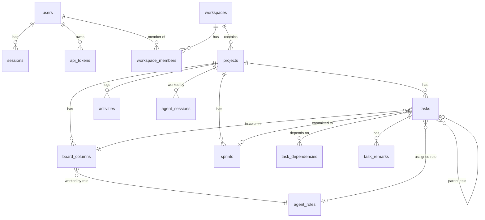

# Architecture

## Components

| Component | Tech | Responsibility |
|---|---|---|
| `apps/web` | React 19, React Router 8, TanStack Query, dnd-kit, Tailwind 4, Vite 8 | UI. Served as static files by unprivileged nginx, which also reverse-proxies `/api` and `/mcp`. |
| `apps/api` | Node 24, Express 5, Drizzle ORM, better-sqlite3, MCP TypeScript SDK | REST API for the UI, Server-Sent Events for live updates, the MCP server for Claude Code, and the workflow engine. |
| `packages/shared` | TypeScript + Zod | Domain constants, validation schemas and DTO types used by both sides. |
| SQLite | WAL mode on the `/data` volume | All state. Created and migrated automatically on start. |

Claude Code runs **on the host**, not in a container. It reaches the MCP server through
nginx (`http://localhost:8080/mcp`) with a personal access token, and writes code into
`workspaces/<workspace-slug>/<project-key>`. That folder is mounted read-only into the API
for the in-app file browser.

## API module layout

```
apps/api/src/
  config/        env (zod-validated), version info
  db/            schema, client, migrator          → drizzle/ holds generated SQL migrations
  lib/           errors, crypto, http helpers, actor, time, logger
  middleware/    session auth, CSRF, rate limits, error handler, request log
  realtime/      in-process event bus (+ EventBatch: publish only after commit), SSE stream
  mcp/           MCP route (stateless Streamable HTTP), server factory + tools, auth, formatting
  modules/
    auth/        login, setup wizard, sessions, password policy
    account/     profile, tokens, sessions (self-service)
    admin/       admin routes, stats, system info, backup
    workspaces/  workspaces + members
    projects/    projects, columns, access control (workspace-inherited)
    tasks/       work items, remarks, dependencies, moves, epics
    sprints/     sprints, burndown
    workflow/    next-work selection, claims, ceremonies, role instructions
    roles/       built-in SDLC roles + custom roles
    presence/    agent sessions / online status
    activity/    project activity feed
    audit/       security audit log
    settings/    admin settings (cached)
    files/       read-only workspace file browser
  app.ts         express app composition (used by tests too)
  bootstrap.ts   migrate + seed defaults
  index.ts       process entry, graceful shutdown
```

Services hold the business rules. Routes and MCP tools are thin adapters that validate
input and call services. All database access is synchronous (better-sqlite3), so each
transaction is atomic within the single Node process. Events are collected in an
`EventBatch` and published only after the transaction commits.

## Data model



Every board has exactly one column per *kind*: `backlog`, `todo`, `in_progress`, `review`,
`testing`, `blocked`, `done`. Names, colours, WIP limits and role mappings can change, but
the kinds anchor the workflow rules.

## Workflow engine (`modules/workflow`)

`get_next_work` decides, inside one transaction:

1. **Kickoff** until `kickoffCompletedAt` is set (a project-level ceremony claim).
2. **Sprint work:** items in To Do, In Progress, Review or Testing that belong to the
   active sprint (or to no sprint). They must not be epics or assigned to a human, must not
   be claimed by someone else, and every dependency must be done. Items are sorted with the
   agent's own claim first, then column position descending (finish work before starting
   new work), then priority, then position. When In Progress is at its WIP limit, To Do
   items are skipped.
3. **Refinement** of unrefined backlog items, epics included.
4. **Sprint review** when an active sprint has no actionable work left.
5. **Sprint planning** when there is no active sprint and refined items exist.
6. Otherwise **complete** or **waiting** (blocked items, human-owned items, open dependencies).

The **effective role** is the column's role. For columns with `roleSource = task`
(To Do, In Progress) it is the item's assigned role, if it is enabled.

**Claims** (`claimedBy = token:<id>`, with an expiry) stop parallel sessions from
colliding. Any stage change releases the claim, and `log_progress` extends it.

**Rework:** moving an item from review or testing back to development increments
`bounceCount`. When the agent exceeds the admin's limit, the item goes to **Needs Human**
with a system remark. A human answer with *resume* returns it to the stage it came from
and resets the counter.

## Realtime

The API keeps an in-process `EventEmitter` per project. Browsers subscribe with
`GET /api/projects/:id/events` (Server-Sent Events). nginx disables buffering on that
route. The stream sends a `hello` event with the server version, then `ProjectEvent`s
(`task.upserted`, `remark.created`, `activity.created`, `agent.presence`, …). The client
applies them directly to the React Query cache and refetches everything after a
reconnect. Every stream re-checks the session and project access every 60 seconds.

## Versioning

The root `package.json` version is the source of truth (`npm run release`). Docker builds
receive `APP_VERSION`, `GIT_SHA` and `BUILD_TIME` as build args. The API exposes them at
`/api/version`. The web bundle embeds its own version, and when the server reports a
different one the UI offers a reload.
