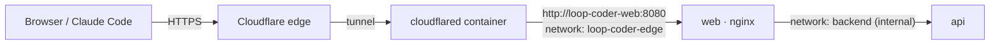

# Publishing with a Cloudflare Tunnel

This publishes Loop Coder at a public HTTPS hostname (for example
`https://loop-coder.solamariweb.com`) without opening any port on your machine. Cloudflare
terminates TLS and the tunnel carries traffic to the `web` (nginx) container.



The tunnel connector can only reach nginx. The API sits on an internal network with no
internet route.

## 1. Configure `.env`

```dotenv
APP_ORIGIN=https://loop-coder.solamariweb.com,http://localhost:8080
COOKIE_SECURE=true
BIND_ADDRESS=127.0.0.1
```

`APP_ORIGIN` lists every URL people use. The first one is canonical and appears in the
setup hint. Browsers may only send state-changing requests from these origins.

## 2. Start Loop Coder

```bash
npm run up          # or: docker compose up -d --build
```

This creates the Docker network `loop-coder-edge`.

## 3a. Use your existing cloudflared container

Attach the cloudflared container that serves your domain to the edge network once. The
attachment survives restarts; repeat it only if you recreate the container.

```bash
docker network connect loop-coder-edge portfolio-tunnel
```

Then add the hostname to that tunnel.

- **Dashboard-managed tunnel (token):** Zero Trust → Networks → Tunnels → your tunnel →
  *Public Hostname* → Add:
  - Subdomain `loop-code`, domain `solamariweb.com`
  - Service type `HTTP`, URL `loop-coder-web:8080`
- **Locally managed tunnel (`config.yml`):** add an ingress rule above the catch-all:
  ```yaml
  ingress:
    - hostname: loop-coder.solamariweb.com
      service: http://loop-coder-web:8080
    # ... your existing rules ...
    - service: http_status:404
  ```
  Then run `cloudflared tunnel route dns <tunnel> loop-coder.solamariweb.com` and restart the container.

If your cloudflared container is managed by its own compose file, declare the network
there instead, so the attachment is permanent:

```yaml
services:
  cloudflared:
    networks: [default, loop-coder-edge]
networks:
  loop-coder-edge:
    external: true
```

## 3b. Or use the built-in connector

Create a new tunnel in Zero Trust, add the public hostname → `http://loop-coder-web:8080`,
put its token in `.env` as `CLOUDFLARE_TUNNEL_TOKEN`, and run:

```bash
docker compose --profile tunnel up -d
```

## 4. Finish the setup wizard immediately

Once the hostname resolves, open `https://loop-coder.solamariweb.com/setup` and complete
the wizard. The one-time code is in the logs:

```powershell
docker compose logs api | Select-String "setup code"
```

Until an administrator exists, nobody can use the app without that code. After setup the
wizard is permanently disabled.

## 5. Cloudflare settings for this hostname

| Setting | Value | Why |
|---|---|---|
| SSL/TLS → Edge certificates → *Always Use HTTPS* | On | Never serve the app over plain HTTP. |
| Speed → *Rocket Loader* | **Off** | It injects inline scripts, which the app's strict CSP blocks (blank page). |
| Scrape Shield → *Email Address Obfuscation* | **Off** | Same reason: injected scripts. |
| Security → WAF → custom rule | *Skip* Bot Fight Mode / managed challenges for `URI Path equals /mcp` | Claude Code is not a browser and cannot solve challenges. The endpoint is protected by bearer tokens and rate limits. |
| Caching | Default | API responses are `no-store`. Static assets are fingerprinted and cached for a year. |

Server-Sent Events (live board updates) work through Cloudflare. The API sends a
heartbeat every 20 s, well inside Cloudflare's idle timeout.

**Optional extra layer:** put the UI behind *Cloudflare Access*, for example with a policy
for your email, and add a *Bypass* policy (or a service token) for the path `/mcp` so Claude
Code can still connect with its bearer token.

## 6. Connect Claude Code to the public URL

On the project's **Claude** tab, the commands already use the URL you opened the page
with:

```bash
claude mcp add --transport http loopcoder https://loop-coder.solamariweb.com/mcp \
  --header "Authorization: Bearer lc_pat_…"
```

## How client IPs are handled

Requests reach nginx from cloudflared, so nginx takes the visitor's address from
`CF-Connecting-IP`, trusting that header only from private networks, and passes it to the
API in `X-Forwarded-For`. Rate limits, account lockout and the audit log therefore see real
visitor IPs.

## Embedding Loop Coder in another site (iframe)

Framing is blocked by default. To show Loop Coder inside pages of your own sites, list them in
`.env` and restart the web container:

```dotenv
FRAME_ANCESTORS=https://solamariweb.com https://*.solamariweb.com
```

```sh
node scripts/compose.mjs up -d web
docker compose logs web | grep frame-ancestors
```

The page is then sent with `Content-Security-Policy: frame-ancestors <your list>` and without
`X-Frame-Options` (which cannot list sites). Accepted values are `none` (default), `self` and
`https://` origins with an optional `*.` subdomain wildcard; anything else stops the web
container with an error in its log. Signing in inside the frame works only when the embedding
page is on the same site (for example `solamariweb.com` embedding
`loop-coder.solamariweb.com`), because session cookies are `SameSite=Strict`.
