# Loop Coder user guide

Loop Coder is a Kanban board for agile software projects that an **AI coding agent works
through on its own**. You describe what you want built. The agent (Claude Code, Cursor,
VS Code with GitHub Copilot, or any other tool that speaks MCP) plans the backlog, then
designs, builds, reviews and tests every item, moving the cards as it goes. You watch the
board update live, answer its questions, and can pause it at any time.

This guide is for everyone who uses Loop Coder: the **administrator** who installs and
manages it, and the **team members** who create projects and work with the agent. You can
open it at any time from **User guide** in the app's sidebar.

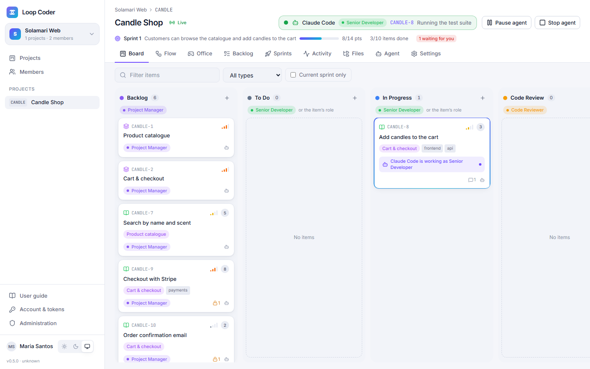

## Contents

1. [Key ideas](#1-key-ideas)
2. [First-time setup (administrator)](#2-first-time-setup-administrator)
3. [Signing in](#3-signing-in)
4. [Workspaces and members](#4-workspaces-and-members)
5. [Creating a project](#5-creating-a-project)
6. [Connecting your AI agent](#6-connecting-your-ai-agent)
7. [What the agent does](#7-what-the-agent-does)
8. [The board](#8-the-board)
9. [The Flow view](#9-the-flow-view)
10. [The agent office](#10-the-agent-office)
11. [Work item details and answering questions](#11-work-item-details-and-answering-questions)
12. [Backlog and refinement](#12-backlog-and-refinement)
13. [Sprints](#13-sprints)
14. [Activity and files](#14-activity-and-files)
15. [Project settings](#15-project-settings)
16. [Your account and access tokens](#16-your-account-and-access-tokens)
17. [Administration](#17-administration)
18. [Dark mode and mobile](#18-dark-mode-and-mobile)
19. [Troubleshooting and FAQ](#19-troubleshooting-and-faq)

---

## 1. Key ideas

Loop Coder organises work the way an Agile team does. These are the words you will see
throughout the app.

| Term | Meaning |
|---|---|
| **Workspace** | A team space that contains projects and members. People are invited to a workspace and get access to all its projects. You can belong to several workspaces. |
| **Project** | One product or codebase with its own board, backlog, sprints and code folder. Every project has a short **key** such as `CANDLE`, so items are numbered `CANDLE-1`, `CANDLE-2`, and so on. |
| **Work item** | A card on the board: an **epic** (a big feature that groups others), **story**, **task**, **bug** or **spike** (a time-boxed investigation). |
| **Agent** | The AI coding tool connected to the project. One agent plays **every role** in the team. |
| **Role** | How the agent behaves in a given stage: Project Manager, Software Architect, UI/UX Designer, Senior Developer, Backend Developer, Frontend Developer, Code Reviewer, QA Engineer, DevOps, Security or Technical Writer. |
| **Sprint** | A batch of work the team commits to, with a goal. It ends with a review and a retrospective. |
| **Definition of Ready / Done** | The checklists an item must meet before it is planned (Ready) and before it is finished (Done). |
| **Needs Human** | The column where the agent puts items it cannot finish without your decision. |

---

## 2. First-time setup (administrator)

The first time Loop Coder starts, every page leads to the **setup wizard**. It creates the
administrator account and the first workspace.

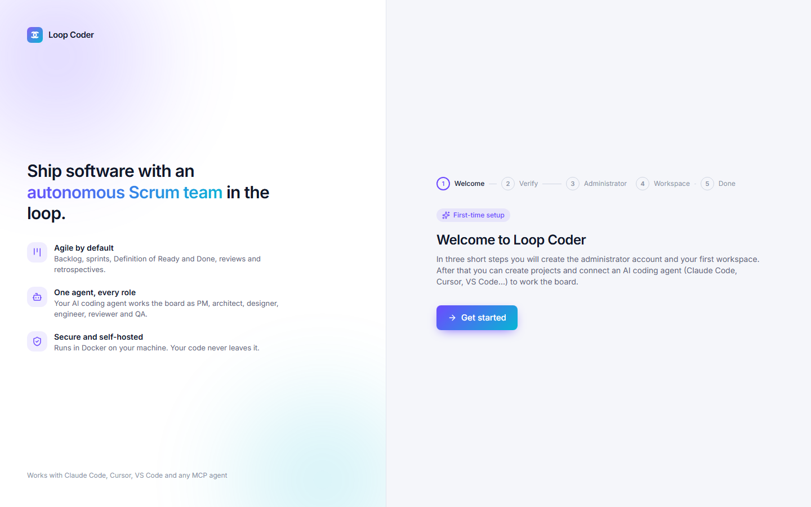

**Step 1: Verify that you own the server.** The wizard asks for a one-time **setup code**,
so that a stranger who reaches the page cannot take over your installation. The code is
in the server log:

```powershell
docker compose logs api | Select-String "setup code"        # Windows PowerShell
docker compose logs api | grep -i "setup code"              # macOS / Linux
```

If `SETUP_CODE` is set in the `.env` file, that value is the code. Codes are not case-sensitive.

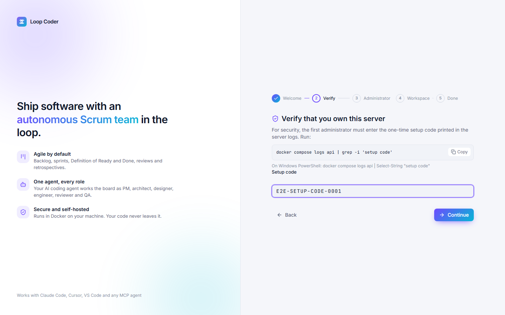

**Step 2: Create the administrator.** Use a long password: at least 12 characters by
default, and a passphrase works well. The administrator manages users, roles, settings and security.

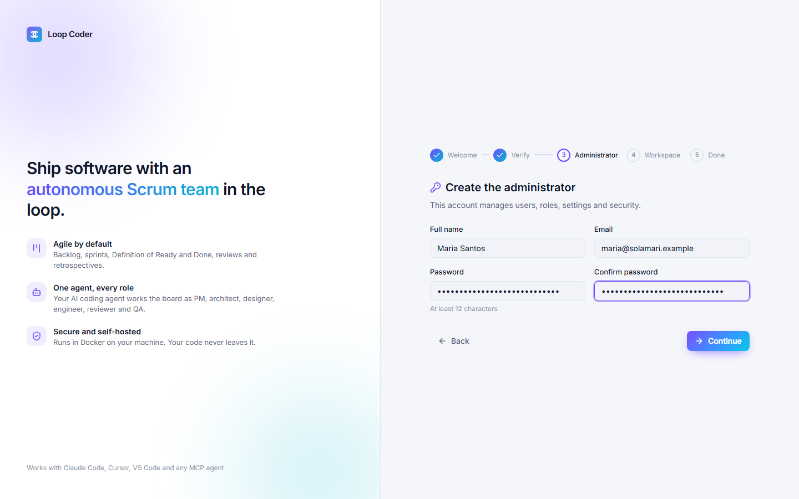

**Step 3: Name your workspace.** You can also rename the application and decide whether
people may register themselves. Leave registration off unless the server is private.

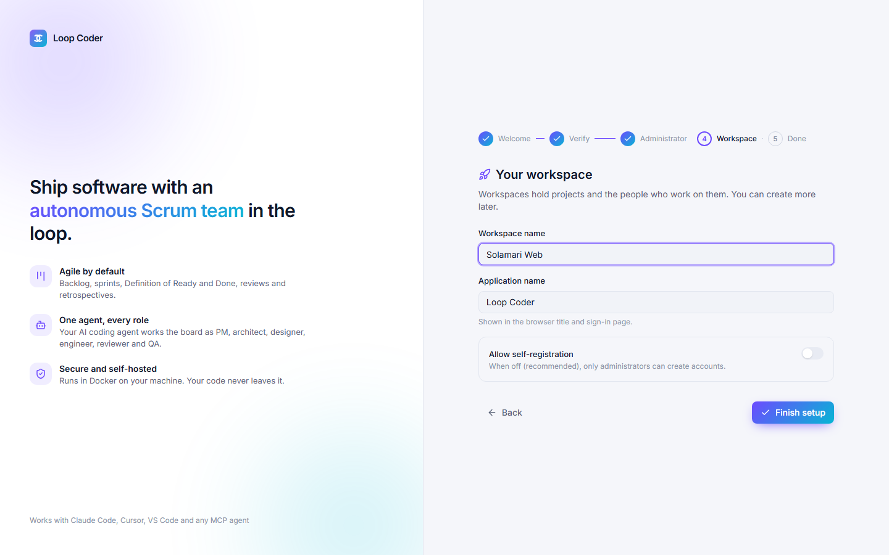

That's it. The wizard turns itself off for good once the administrator exists.

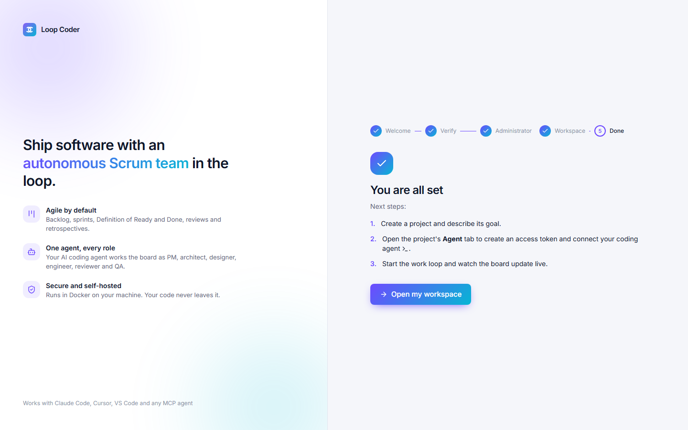

> [!IMPORTANT]
> **Publishing on the internet?** Finish the wizard *before* you make the site public, for
> example through a Cloudflare Tunnel. See [DEPLOY.md](DEPLOY.md).

---

## 3. Signing in

Go to your Loop Coder address (for example `http://localhost:8080`) and sign in with
your email and password.

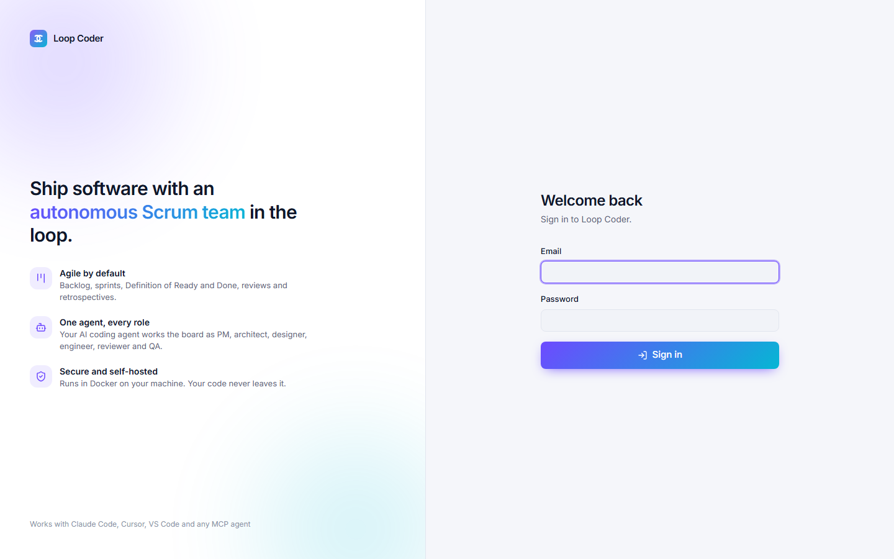

- After several wrong passwords in a row (5 by default), the account is **locked for 15
  minutes**. An administrator can unlock it sooner.
- Sessions last 72 hours and are extended while you use the app. Changing your password
  signs you out everywhere else.
- Use the menu with your name at the bottom left to open **Account** or **Sign out**.
  Next to it, switch between **light**, **dark** and **system** theme.

---

## 4. Workspaces and members

The sidebar shows your current workspace at the top. Click it to switch workspaces or
create a new one. Below it you find the workspace's **Projects** and **Members** and the
list of its projects.

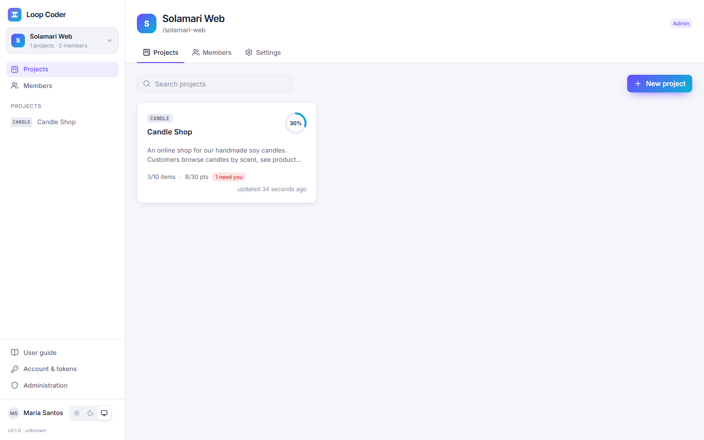

Each project card shows its progress, story points, and whether the agent is paused,
waiting for the kickoff, or needs you.

### Members and permissions

Open **Members** to see who has access. Workspace owners can invite people (they need an
account first, which an administrator can create), change roles, remove members, or
transfer ownership.

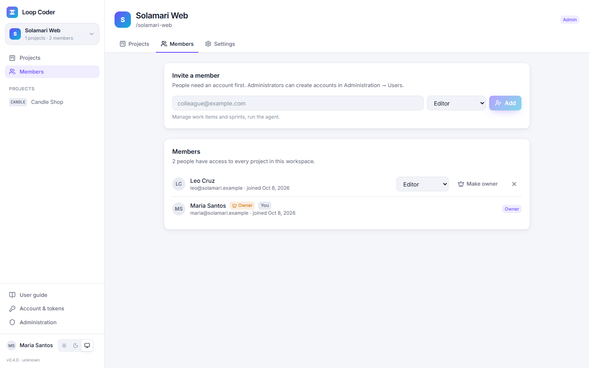

| Workspace role | Can do |
|---|---|
| **Owner** | Everything, including project and workspace settings, members and deleting. |
| **Editor** | Create projects and work items, plan sprints, comment and answer the agent, pause and resume the agent, create access tokens. |
| **Viewer** | Read boards, backlog, sprints, activity and files. Cannot change anything. |

Platform **administrators** can open every workspace, whether or not they are a member.

---

## 5. Creating a project

A project is one product or codebase. It gets its own board, backlog, sprints and code folder,
all set up for you. Click **New project** on the workspace page.

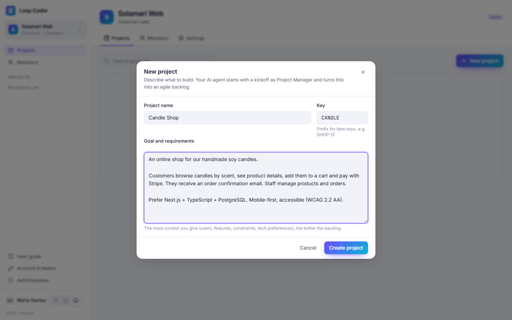

- **Project name** and **Key**: the key (2–8 letters and digits) prefixes every item number
  and must be unique on the server. It is suggested from the name.
- **Goal and requirements**: this is what the agent reads during the kickoff. The more
  context you give, the better the backlog. Describe who the users are, the main
  features, constraints, and any preferred technology.

After creating the project you land on its **Agent** tab to connect your AI agent.

> [!TIP]
> Write the goal like a short brief for a new team member: who it is for, what they must be
> able to do, what is out of scope, and any technology you want or must avoid.

---

## 6. Connecting your AI agent

Open the project's **Agent** tab. Choose your tool (**Claude Code**, **Cursor**, **VS Code**
or **Other MCP client**) and your operating system. The page then shows exactly what to do.

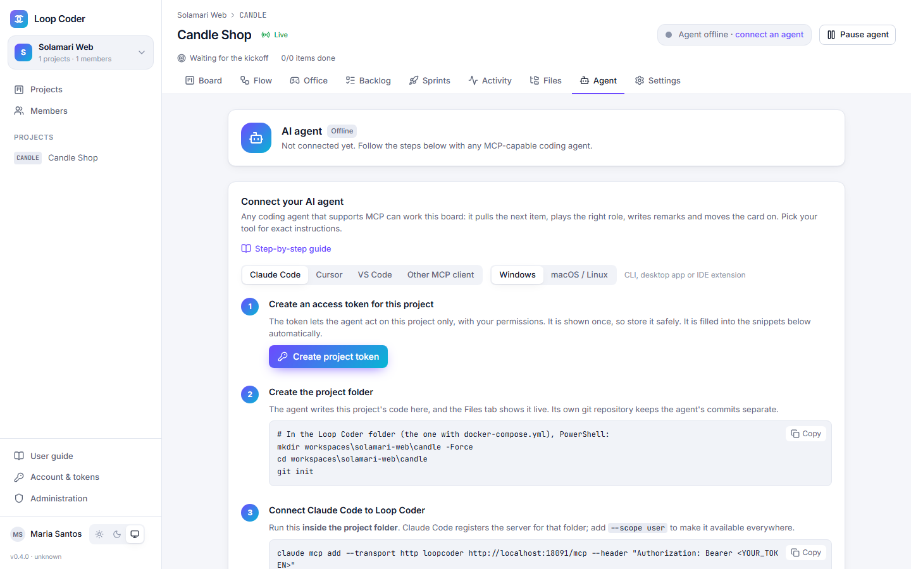

### Step 1: Create a project token

Click **Create project token**. The token lets the agent act on **this project only**,
with your permissions. It is shown **once**, so copy it now. All snippets on the page fill in
the token automatically.

### Step 2: Create the project folder

The agent writes the project's code into `workspaces/<workspace>/<project>` inside the
Loop Coder folder, and the **Files** tab shows it live. Run the commands shown (they include
`git init`, so the project gets its own repository).

### Step 3: Connect the agent

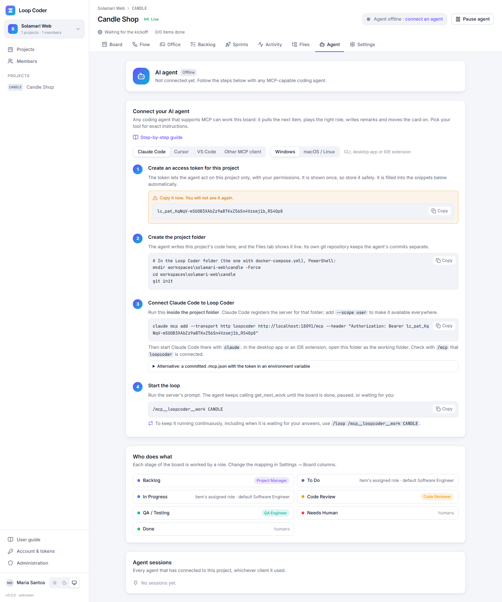

- **Claude Code** (command line, desktop app or IDE extension): run the `claude mcp add …`
  command **inside the project folder**, because Claude Code registers servers per folder.
  Add `--scope user` to make it available everywhere. Then start Claude Code there and type
  `/mcp` to check that `loopcoder` is connected.
- **Cursor**: create `.cursor/mcp.json` in the project folder with the snippet shown, open the
  folder in Cursor, and enable the server under **Settings → MCP**.
- **VS Code**: create `.vscode/mcp.json`, open the folder, start the server from the MCP list,
  and use Copilot Chat in **Agent** mode.
- **Other MCP clients**: use the URL and header shown. Tools that only run local servers use
  the `mcp-remote` bridge snippet.

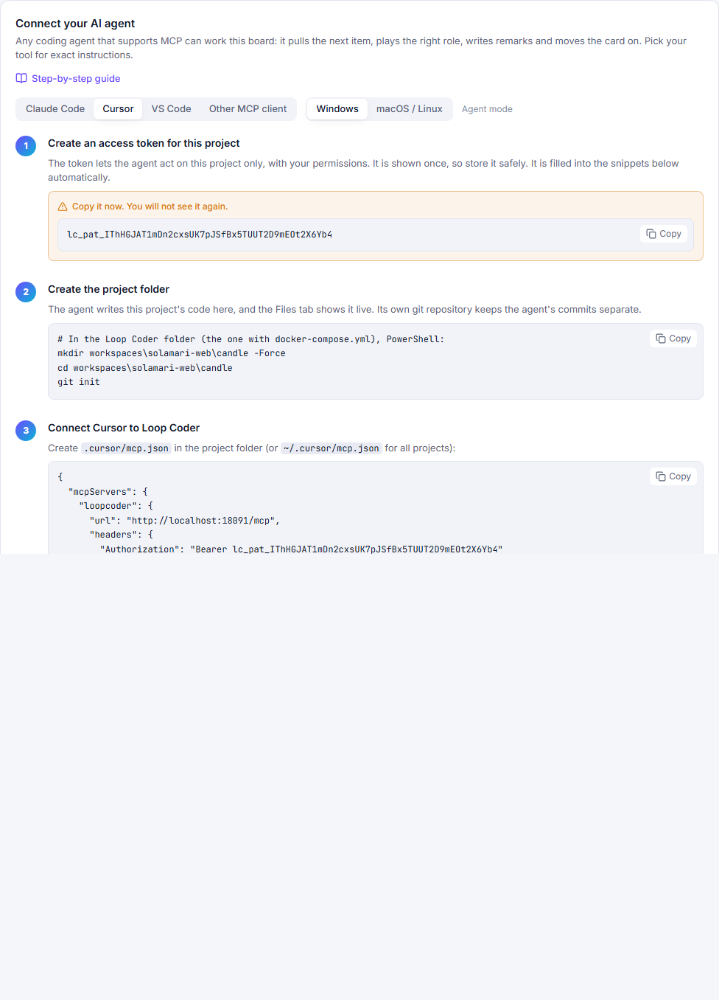

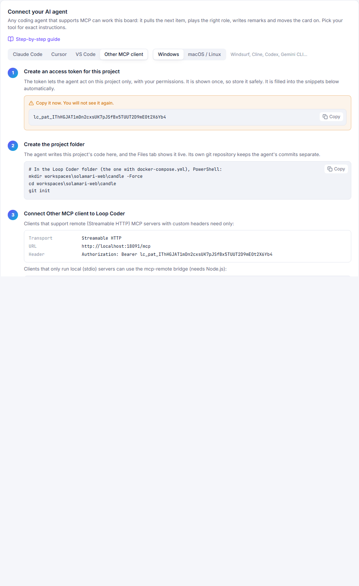

> [!WARNING]
> **Keep tokens private.** Files that contain the token (`.cursor/mcp.json`,
> `.vscode/mcp.json`) must be added to the project's `.gitignore`.

### Step 4: Start the loop

- **Claude Code**: run `/mcp__loopcoder__work CANDLE`, using your project key. To keep it
  running continuously, including picking up again after you answer its questions, use
  `/loop /mcp__loopcoder__work CANDLE`.
- **Other agents**: paste the instructions shown into the agent chat in agent mode. When the
  agent stops because it is waiting for you, answer on the board and send the same instructions again.

The agent now works on its own. You can follow everything on the board.

> [!TIP]
> Several agents can work on the same project at once, for example Claude Code building
> features while Cursor does QA. Create one token per agent so each is labelled correctly.

---

## 7. What the agent does

The agent always asks Loop Coder what to do next. Loop Coder answers like a Scrum Master
would, in this order:

1. **Kickoff** (once, as Project Manager): it reads your goal, writes the vision, tech stack
   and conventions into the project notes, and creates the first backlog of epics and stories.
2. **Sprint work** (pull from the right): it finishes items closest to **Done** before
   starting new ones, and respects dependencies and WIP limits. The role changes with the stage:
   - **In Progress**: the item's assigned role does the real work in the code folder. For
     code, the Project Manager picks the **Backend Developer** (APIs, data, business logic,
     integrations), the **Frontend Developer** (screens, components, accessibility) or the
     **Senior Developer** (work that spans both, foundation code, complex changes and hard
     bugs); other items go to the Architect, UI/UX Designer, DevOps, Security or Technical
     Writer. An item without a role goes to the Senior Developer.
   - **Code Review**: the Code Reviewer approves it or sends it back with a numbered list of changes.
   - **QA / Testing**: the QA Engineer checks every acceptance criterion and runs the tests,
     then sends the item to Done with a test report, or back for a fix.
3. **Backlog refinement** (as Project Manager): it turns rough ideas into ready stories with
   acceptance criteria, estimates and dependencies, and splits large items.
4. **Sprint review and retrospective**: when the sprint's work is finished.
5. **Sprint planning**: it picks the highest-value ready items up to the sprint capacity and
   sets a sprint goal.

If something only a person can decide comes up, the agent **asks you** by moving the item
to **Needs Human**. If an item is sent back for rework too often (more than 4 times by default), it is
escalated to you automatically.

---

## 8. The board

Every project has one board. Work items move from left to right through the columns below,
and the board updates live while the agent works.


| Column | Who works it | What happens there |
|---|---|---|
| **Backlog** | Project Manager | Ideas and stories wait here and are refined until they meet the Definition of Ready. |
| **To Do** | the item's role | The sprint's committed items. When the agent picks one up it moves to In Progress. |
| **In Progress** | the item's role | Design, code, infrastructure or documentation work. |
| **Code Review** | Code Reviewer | Approve → QA, or request changes → back to In Progress. |
| **QA / Testing** | QA Engineer | Verify → Done, or report a failure → back to In Progress. |
| **Needs Human** | you | Questions from the agent and escalated items. |
| **Done** | none | Meets the Definition of Done. Epics finish automatically when all their items are done. |

### Live status and pausing

The header shows which agent is working, in which role, on which item, and what it is
doing right now. **Live** next to the project name means updates arrive in real time.


Three buttons control the agent. Editors and owners can use them.

| Button | What the agent does |
|---|---|
| **Pause agent** | Finishes its current step, then waits. Until then the header says, for example, *Pausing · finishing NT-26 as Frontend Developer first*. It stays connected (checking in about once a minute) and carries on by itself the moment you click **Resume agent**. |
| **Resume agent** | Carries on at once if it was waiting. After a stop, the agent may work again, but you start it again from your coding agent (the Agent tab shows how). |
| **Stop agent** | Finishes its current step (the header says *Stopping* until then) and ends its session. Use it when you are done for the day or want to change something before it continues. |

The agent also waits, rather than ending, when nothing can move until you answer a question
in **Needs Human**: answer it and the agent picks the work up again.

The line under the title shows the active sprint, its goal and progress, how many items are
done, and a red **waiting for you** badge when the agent needs an answer.

### Reading a card

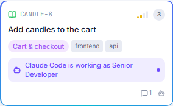

- **Top row:** type icon (epic, story, task, bug, spike), the item key, a **draft** label if
  it is not refined yet, priority bars (more bars = higher priority), and the story points.
- **Title**, then the **epic** it belongs to and any **labels**.
- **Agent bar:** a glowing border and "*Claude Code is working as Senior Developer*" show
  which agent is working on it and in which role. Several agents can work on one project at
  the same time.
- **Bottom row:** the role for the current stage, a lock with a number when it waits on
  unfinished dependencies, a red ↺ number for rework cycles, the number of remarks, and a robot
  icon when the agent created it.

### Column headers

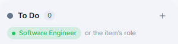

Each column shows its item count and, if set, the **WIP limit** (for example `3/4`). The
count turns red when the limit is exceeded. Below it is the role that works the column.

### Working on the board yourself

- **Drag and drop** cards between columns and within a column. With the keyboard, focus a
  card, press **Space** to pick it up, use the arrow keys, and press **Space** again to drop it.
- Click **+** on a column to quick-add an item there.
- Use **Filter items**, the **type** filter and **Current sprint only** to focus.
- Click a card, or press **Enter** on it, to open its details.

---

## 9. The Flow view

The **Flow** tab shows the project's SDLC as a live graph: the Scrum loop (kickoff, sprint
planning and sprint review) at the top, the delivery pipeline from Backlog to Done in the
middle, and Needs Human underneath.

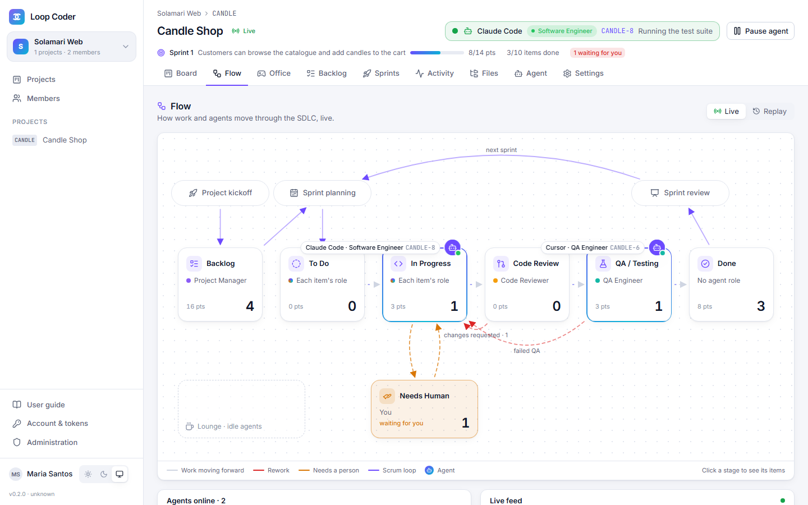

- **Stages** show how many items they hold, the role that works them and their WIP limit.
  Click a stage to list its items, and click an item to open it.
- **Agents** are the round markers. They glide to the stage they are working in, labelled with
  their name, role and item. A speech bubble shows what an agent just reported.
- **Work items travel** along the paths as cards move, and the path lights up. Dashed red arcs
  are **rework** (changes requested, failed QA), labelled with how often they happened. Amber
  paths lead to and from **Needs Human**.
- The **Live feed** lists every move the moment it happens.

### Replay and item journeys

Switch to **Replay** to play back what really happened, on a real clock:

- **What to replay:** the **Whole project**, the **Kickoff**, or one **sprint** at a time
  (each sprint runs from the end of the one before until it completed, so its refinement,
  planning and review are included). A sprint still running is marked *(ongoing)*.
- The clock shows the exact date and time of the moment on screen, and how far into the part
  you are. Events, remarks and agents appear at the time they really happened, so a busy
  minute is busy and a quiet hour is quiet.
- **Play** runs the clock faster than real time: from **1×** (real time) to **1800×** (30
  minutes per second). **Skip quiet times** jumps over stretches where nothing happened for
  more than two minutes and says how much it skipped.
- **Previous / Next moment** jump to the moments something happened: a move, a remark, an
  agent changing role or item, or going offline. You can also drag the slider.
- Agents are shown exactly where they were: Loop Coder records what every agent shows (role,
  item, ceremony, activity) while it works. History from before that recording started (version
  0.4.0) shows agents inferred from their actions instead, and the replay bar says so.

To follow one item, open it and click **Replay journey** (the route icon in the item's header).
The **Journey** panel lists every stage the item went through, who moved it in which role and
how long it stayed in each stage, and the graph highlights the paths it took.

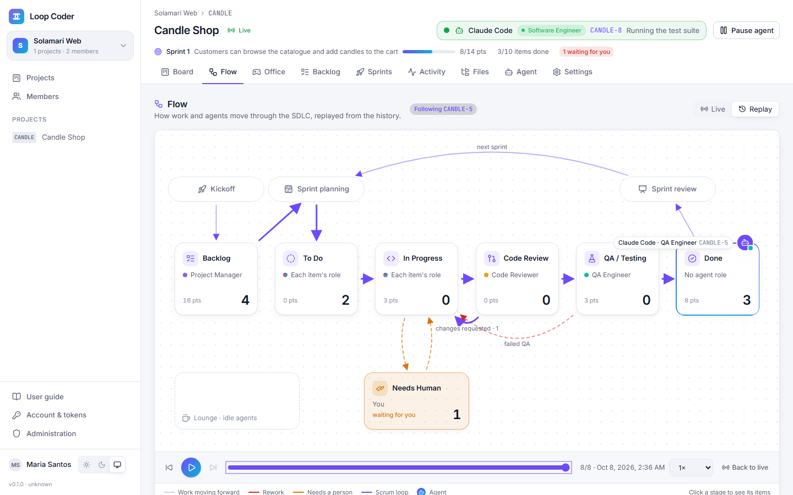

> [!TIP]
> Rework arcs with high counts show where work bounces back. If many items return from review,
> refine them better or tighten the Definition of Ready.

---

## 10. The agent office

The **Office** tab shows the same live data as a small pixel-art game. The office has an area
for every stage: the backlog library, the meeting room for the Scrum ceremonies, the sprint
board, the workshop, the ops and security corner, the review room, the QA lab, the ship dock,
the help desk (Needs Human) and a lounge for idle agents.

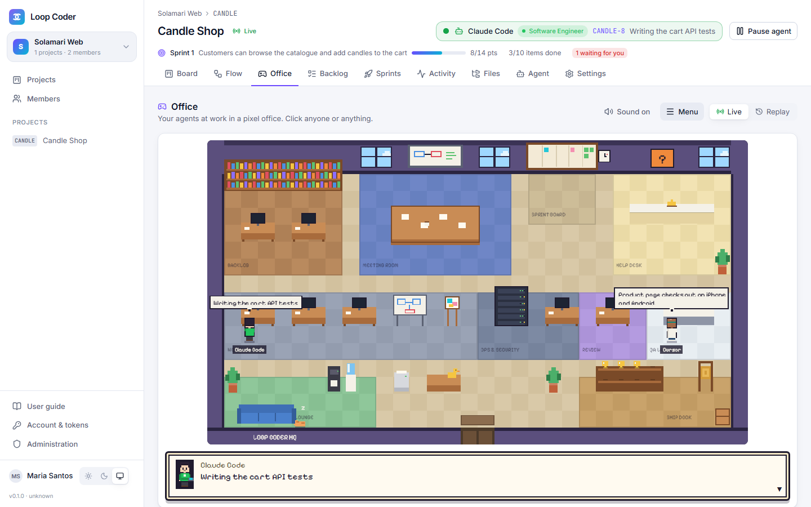

- The office has **one character per role**, each with its own desk and look: the Project
  Manager and the Technical Writer in the backlog library, the engineers, the architect (at the
  whiteboard) and the designer (at the easel) in the workshop, DevOps and Security in the ops
  corner, the Code Reviewer in the review room and QA in the lab. Roles your administrator adds
  later join the team at a free desk, dressed in the role's colour.
- When an agent works in a role, it **plays that character**: the character walks to where the
  work is, types at its desk, and gets a second name tag with the agent's name. When the agent
  moves on to another role, the next character takes over and the previous one goes back to its
  desk. If two agents play the same role at once, a colleague walks in to help.
- Characters **talk** in speech bubbles as they work: progress updates, work logs, review notes,
  test reports and questions. The latest line also types out in the dialogue box under the map,
  and **Office chatter** keeps every line. A character with a question for you waits at the help
  desk. When you answer, you appear behind the desk.
- Characters with nothing to do have a life of their own: they play on the console or the
  arcade machine, fetch a coffee, or meet colleagues for a chat (you can read the conversation in
  their speech bubbles). During kickoff, sprint planning and sprint review the whole team meets
  in the meeting room.
- The **Team** panel lists every role, which agent is playing it and on which item.
- The sprint board on the wall, the trophy shelf at the ship dock and the blinking help sign
  show the real numbers from the board.
- **Click anyone or anything.** Characters tell you what they are doing (from "No bugs to hunt
  right now" to "Shh, boss level!") and get annoyed if you keep poking them. The rubber duck, the coffee machine, the plant, the printer, the cat, the
  help desk bell, the release gong and the server rack all react. With the keyboard, focus the
  map, choose with the arrow keys and press Enter.

### Sound, music and the game menu

Click **Menu** (or press M while the map has focus) to open the game menu.

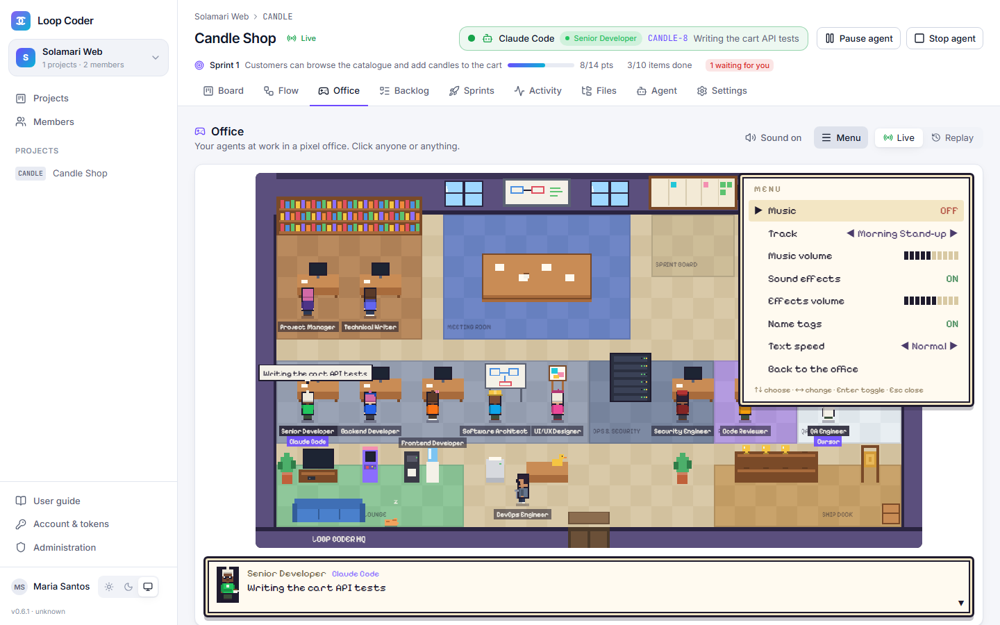

| Setting | What it does |
|---|---|
| **Music** | Original chiptune background music. Off until you turn it on. |
| **Track** | *Morning Stand-up*, *Deep Focus* or *Release Day*. |
| **Music volume**, **Effects volume** | Ten steps each. |
| **Sound effects** | Footsteps, text beeps, the duck, the gong and the other effects. |
| **Name tags** | Show or hide the names under the characters. |
| **Text speed** | How fast speech types out. |

Choose and change settings with the arrow keys, toggle with Enter and close with Esc. Your
browser remembers them. **Sound on / Mute** next to the menu silences everything at once.
Browsers only allow sound after you click or press a key on the page, so the office starts
silent.

> [!NOTE]
> The office has a **Replay** mode too, with the same clock and the same choice of the whole
> project, the kickoff or a sprint: the characters walk to where the agents really were and say
> what was really said (moves, progress notes, reviews, test reports and questions), each at
> the moment it happened.

---

## 11. Work item details and answering questions

Click any card to see everything about the item: its details, its history, and the place where
you answer the agent's questions.

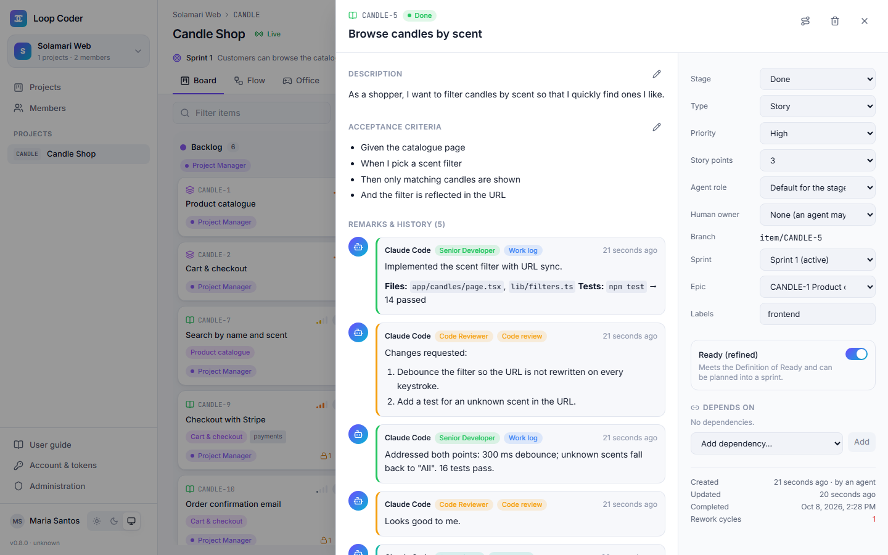

The details panel opens on the right:

- **Title, description and acceptance criteria** can be edited (click the pencil). Markdown is
  supported: lists, tables, code.
- **Properties** on the right: stage, type, priority, story points, **agent role** (who
  implements it), **human owner** (when set, the agent leaves the item alone), sprint, epic,
  labels and the **Ready (refined)** switch.
- **Depends on**: items that must be done first. The agent will not start an item while its
  dependencies are open.
- **Remarks and history**: everything the agent and your team wrote, labelled with the
  author, the role and the kind of remark (work log, design, code review, test report,
  question, answer, comment).

### Answering the agent

When the agent needs a decision, the item appears in **Needs Human** with its question.

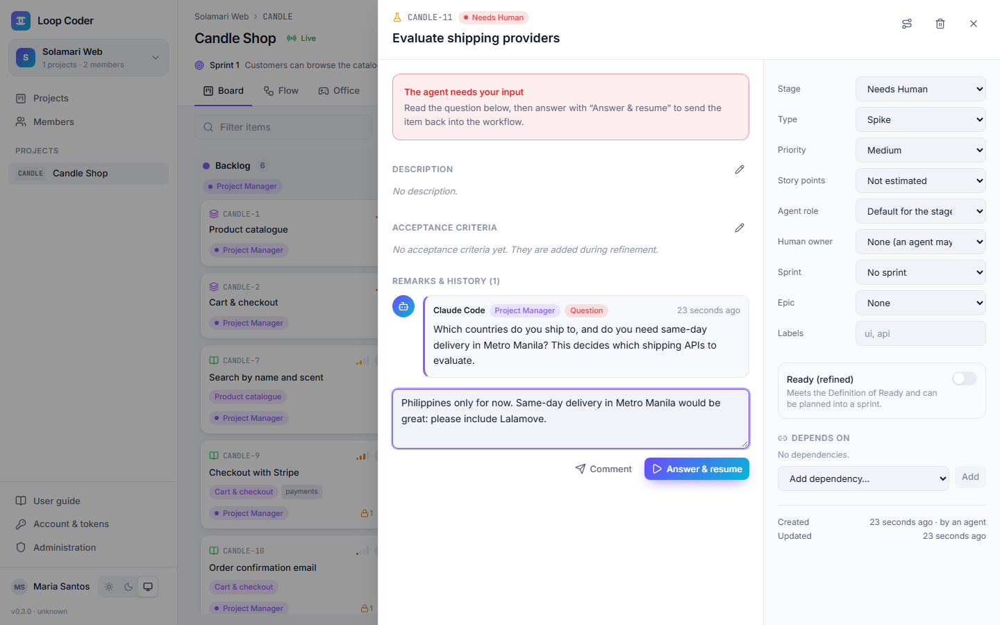

1. Open the item and read the question.
2. Type your answer in the box below the remarks.
3. Click **Answer & resume**. The item goes back to the stage it came from, the rework counter
   resets, and the agent continues with your answer the next time it picks up work.

Use **Comment** instead for remarks that should not send the item back yet.

> [!NOTE]
> The agent picks up your answer the next time it asks for work. With Claude Code's `/loop`
> that happens automatically; with other agents, send the loop instructions again.

---

## 12. Backlog and refinement

The **Backlog** tab lists everything that is not done yet.

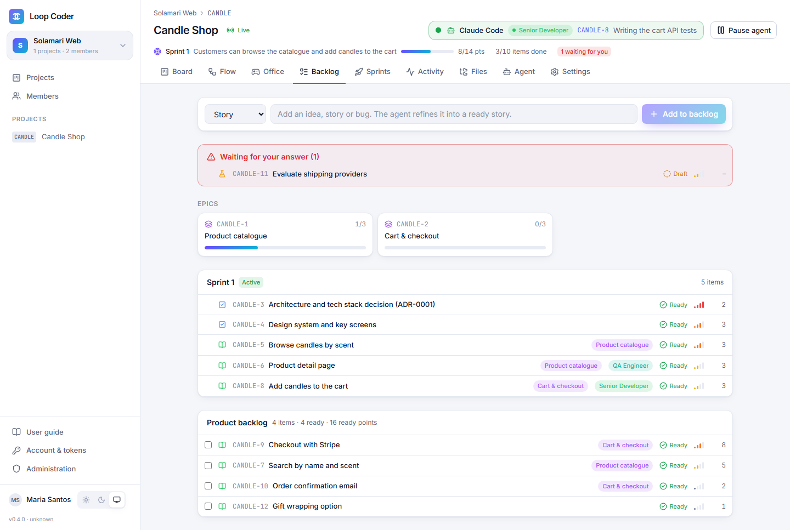

- **Add to backlog** at the top: type an idea and choose its type. It starts as a *Draft*,
  and the agent's Project Manager refines it into a ready story.
- **Waiting for your answer** lists items in Needs Human.
- **Epics** show their progress. Click an epic to filter the lists to its items, or
  double-click it to open it.
- The **active sprint** and the **product backlog** are listed separately with readiness,
  priority, assigned role and story points.
- **Planning a sprint yourself:** tick ready items, choose a sprint, and click **Add to
  sprint**. Usually the agent does this during sprint planning.

---

## 13. Sprints

The agent runs sprints on its own: it plans them, works through them and closes them with a
review. The **Sprints** tab shows their progress, and you can plan, start and complete sprints
yourself too.

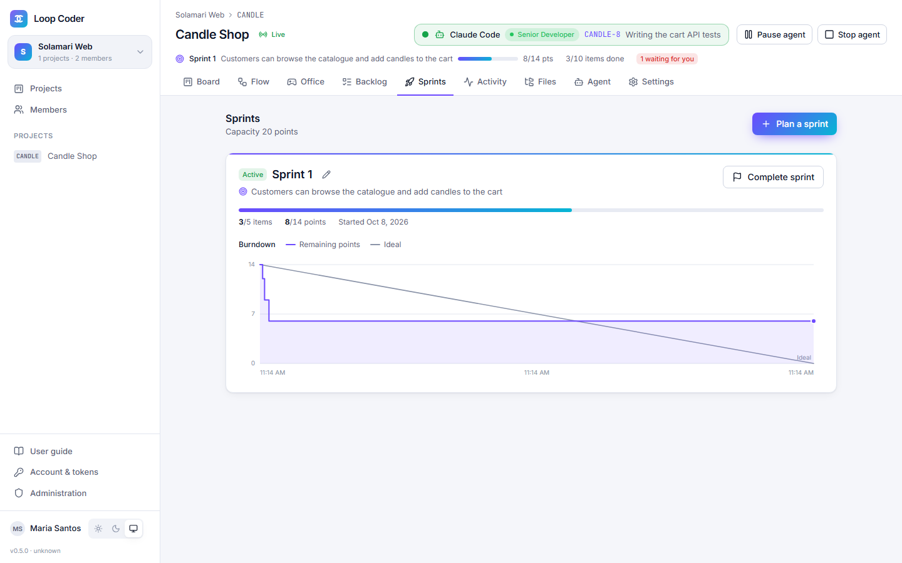

- The **active sprint** shows its goal, progress in items and points, and a **burndown chart**
  of remaining story points (purple) against an ideal line (grey). Hover over or focus the
  chart to read exact values.
- **Plan a sprint** creates a planned sprint. Start it when no other sprint is active.
- **Complete sprint** asks for review and retrospective notes. Items that were never started
  return to the backlog, and items in progress carry over to the next sprint automatically.
- **Completed** sprints keep their review and retrospective notes. The header shows the
  sprint capacity and the average velocity of recent sprints.

---

## 14. Activity and files

**Activity** is the project's live timeline: who did what and when. Filter it to the agents
or to people.

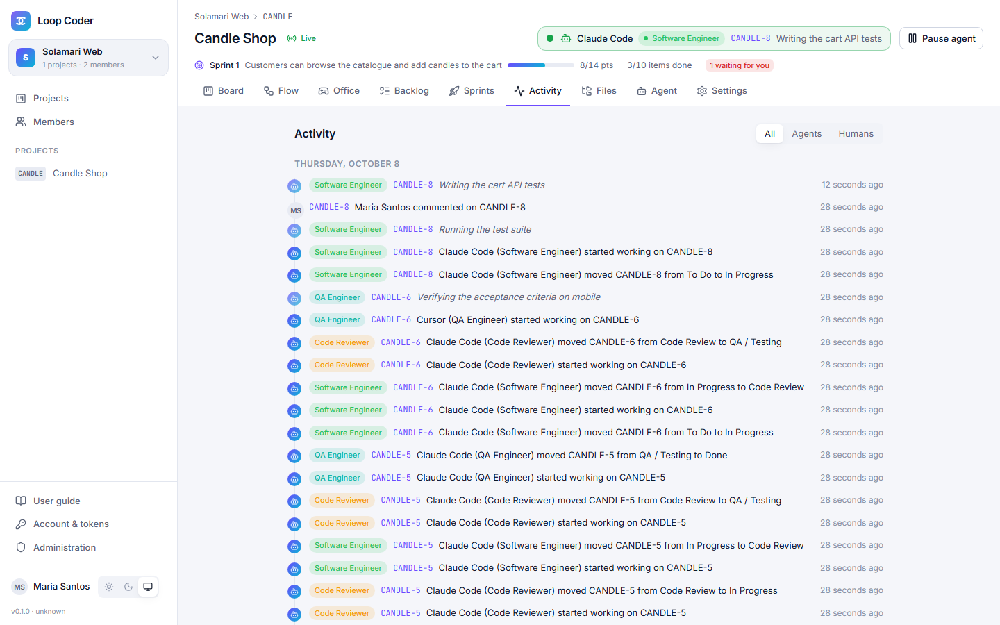

**Files** shows the code in the project folder, read-only, as the agent writes it. Click
folders to expand them and files to view them.

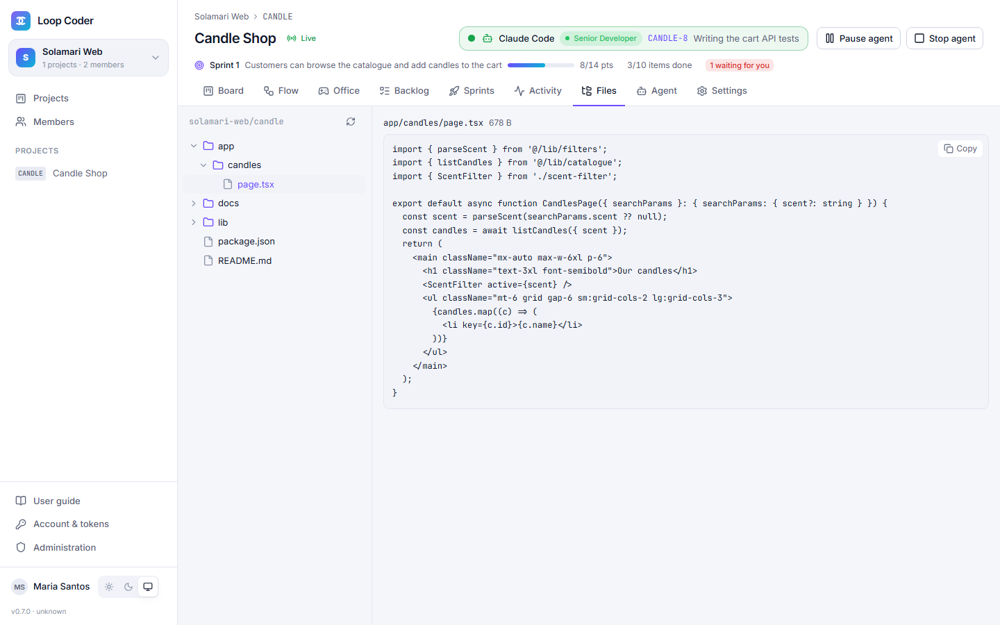

---

## 15. Project settings

Shape how the team works: the goal, the Definitions of Ready and Done, shared notes and the
board columns. Project owners find these settings under **Settings**.

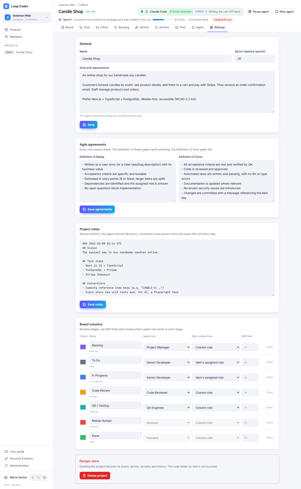

- **General:** name, goal and requirements, and **sprint capacity** in story points.
- **Agile agreements:** the **Definition of Ready** and **Definition of Done**. Every role
  checks them.
- **Project notes:** the team's shared memory. The agent records decisions, conventions and
  lessons here and reads them at every step. You can edit them too.
- **Board columns:** rename columns, change colours, set **WIP limits**, choose which **agent
  role** works each column, and whether the role comes from the column or from each item's
  assigned role.
- **Danger zone:** delete the project. You must type the project key to confirm. The code
  folder on disk is not touched.

---

## 16. Your account and access tokens

Manage your profile, password and signed-in browsers, and the tokens your agents use to
connect. Open **Account & tokens** in the sidebar.

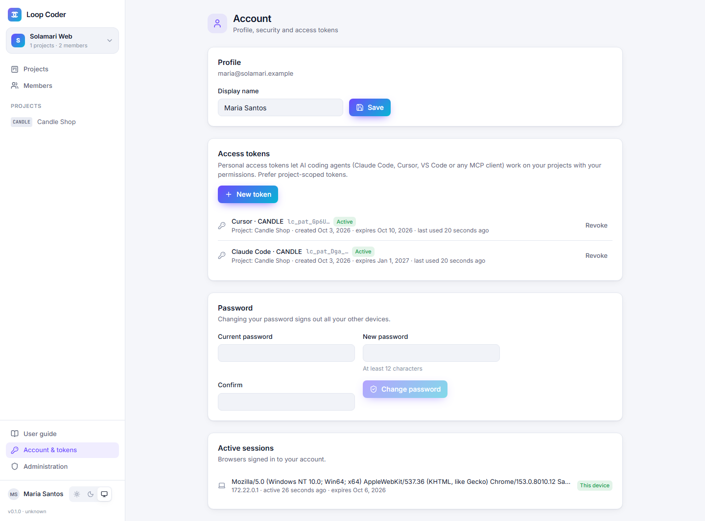

- **Profile:** your display name.
- **Access tokens:** create, see and revoke the tokens your agents use. Give each token a
  clear name, limit it to **one project or workspace** whenever you can, and choose an
  expiry. The token value is shown only once. Revoking it stops every agent using it immediately.
- **Password:** change it. All your other sessions are signed out.
- **Active sessions:** every browser signed in to your account. Sign out the ones you don't recognise.

---

## 17. Administration

Everything about the server in one place: users, workspaces, agent roles, security settings,
the audit log and backups. Administrators see **Administration** in the sidebar.

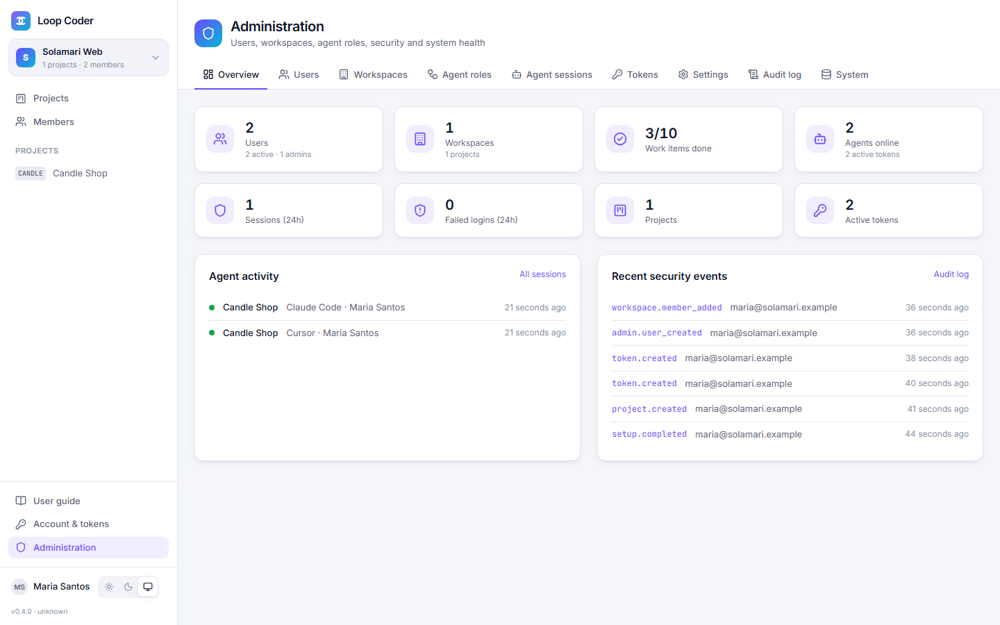

| Page | What you can do |
|---|---|
| **Overview** | Users, workspaces, finished work, agents online, sessions and failed sign-ins in the last 24 hours, recent agent activity and security events. |
| **Users** | Create users, make or remove administrators, disable or enable accounts, unlock locked accounts, reset passwords, sign a user out everywhere, delete users (their workspaces are transferred to you). |
| **Workspaces** | Every workspace and project on the server; open or delete them. |
| **Agent roles** | Edit the instructions of the eleven built-in roles, or add your own roles (for example a Data Engineer). |
| **Agent sessions** | Every agent connection: which tool, for which project, on whose behalf, how many tool calls and finished items. |
| **Tokens** | All access tokens of all users; revoke any of them. |
| **Settings** | Registration, password and lockout rules, session and token lifetimes, the agent **kill switch**, rework limit, claim timeout. |
| **Audit log** | A permanent record of sign-ins, failed attempts, lockouts, admin actions, token and settings changes. |
| **System** | Server version, commit, uptime, database size and schema version, and **Download backup**. |

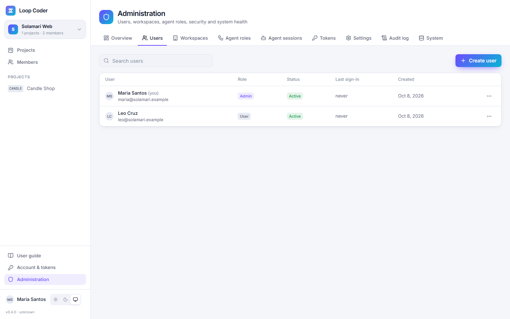

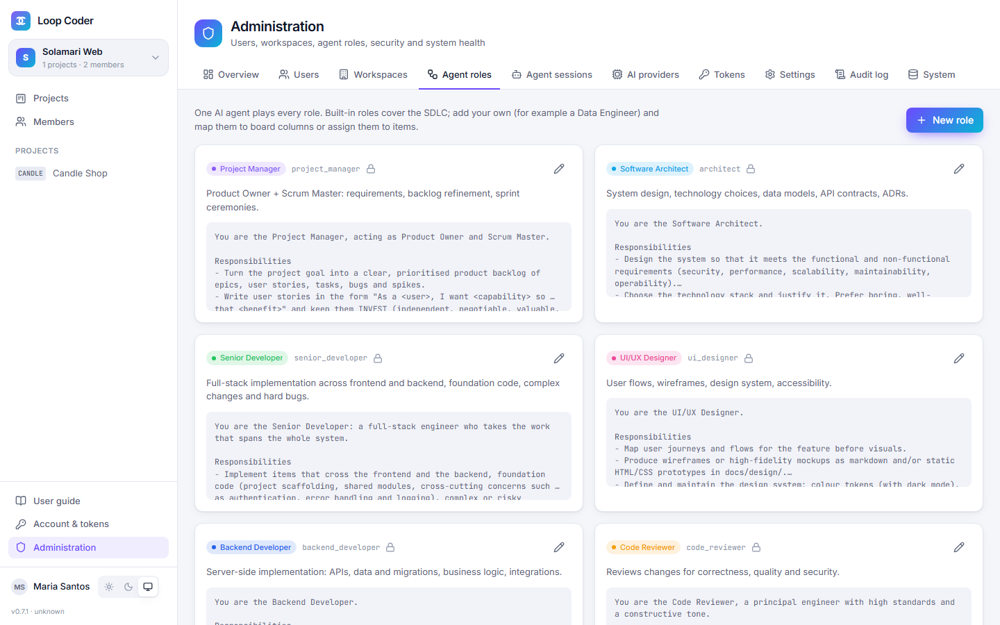

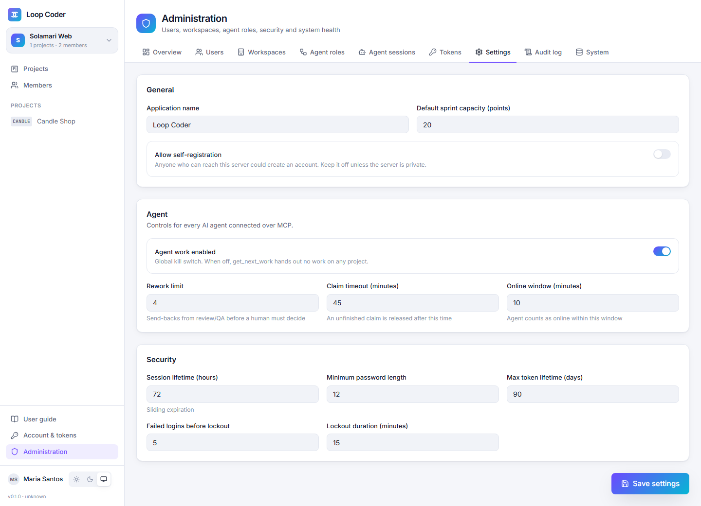

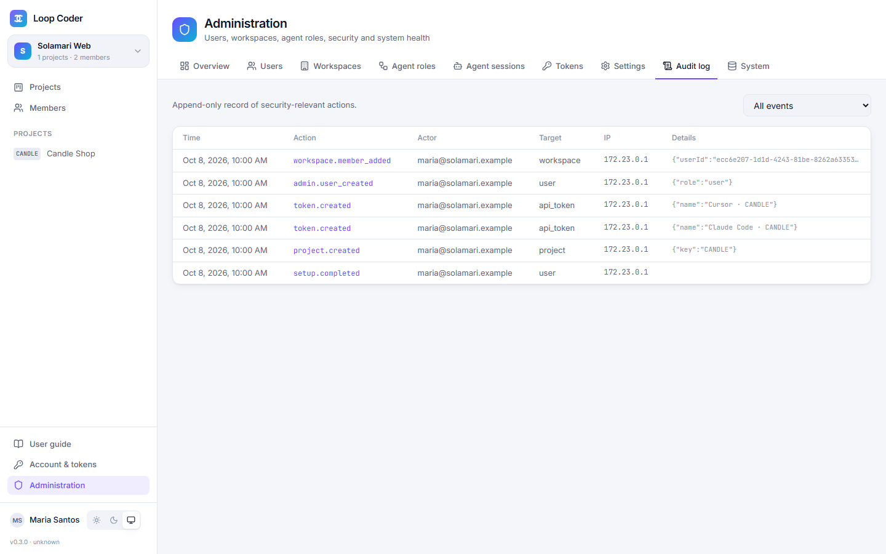

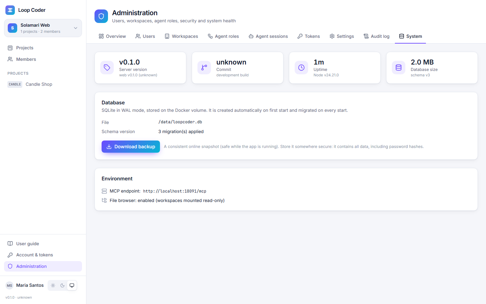

> [!CAUTION]
> **Backups** contain all data, including password hashes. Store them somewhere secure.

---

## 18. Dark mode and mobile

Loop Coder follows your system's light or dark preference unless you choose one in the
sidebar.

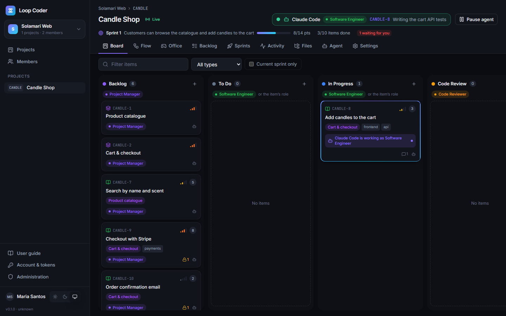

On a phone, open the navigation with the menu button at the top left. Scroll the board
sideways to see all columns.

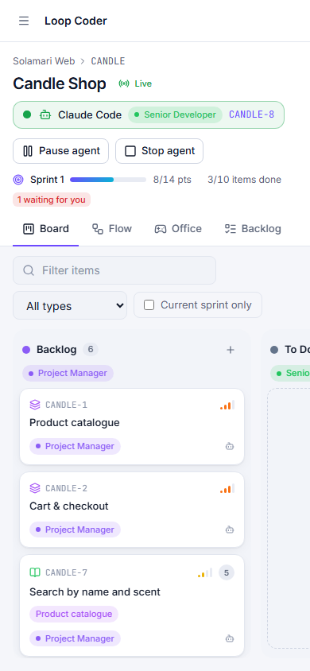

---

## 19. Troubleshooting and FAQ

Answers to the questions people ask most often, from a paused agent to a locked account.

**The agent says "STATUS: PAUSED".** Someone paused the project. The agent keeps waiting and
carries on when you click **Resume agent** on the board. If it says **STOPPED**, someone stopped
it: click **Resume agent**, then start the agent again from your coding agent. If it says
**DISABLED**, an administrator has turned off agent work under Administration → Settings.

**The agent says "STATUS: WAITING".** Nothing can move without people. Check **Needs Human**,
items assigned to a human owner, and items whose dependencies are not done. The agent waits
and carries on as soon as you answer or free up an item.

**The agent cannot connect (401 Unauthorized).** The token is wrong, expired or revoked, or
the `Bearer ` prefix is missing from the header. Create a new token on the Agent tab.

**Claude Code does not show the `loopcoder` server.** You added it in a different folder. Run
the `claude mcp add` command inside the project folder, or add `--scope user`.

**The Files tab is empty.** The agent has not written any code yet, or it is working in a
different folder than the one shown on the Agent tab.

**"Invalid setup code".** Read the latest code from the server log. If `SETUP_CODE` is not
set, the code changes every time the server restarts.

**My account is locked.** Wait 15 minutes or ask an administrator to unlock it.

**Can several agents work on the same project?** Yes. Each one claims different items, and
every card shows which agent is working on it.

**Can I keep working on the board while the agent works?** Yes. Changes from both sides
appear live. If you move an item the agent is working on to another column, its claim is released.

**Does my code leave my computer?** Loop Coder itself never sends your code anywhere. It runs
in Docker on your machine. Your AI agent uses its own provider (for example Anthropic for
Claude Code) according to that tool's settings.

---

*Screenshots are generated automatically from a demo project with `npm run docs:screenshots`.*

**There is no sound in the office.** Click the map or the menu first: browsers only play
sound after you interact with the page. Then check **Sound effects** and the volumes in the
game menu, and that the browser tab is not muted.
